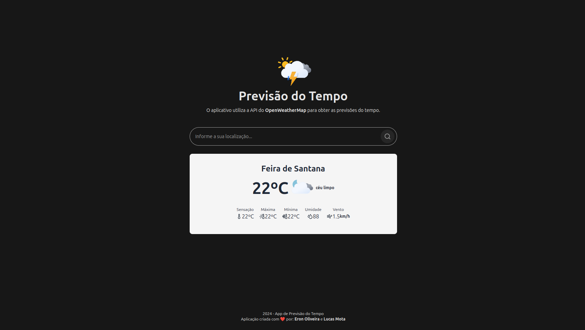

<h1 align="center">App de Previsão do Tempo</h1>

  <a href="#-projeto">Sobre o Projeto</a>&nbsp;&nbsp;&nbsp;|&nbsp;&nbsp;
  <a href="#-tecnologias">Tecnologias Utilizadas</a>&nbsp;&nbsp;&nbsp;

 

  

## 💻 Sobre o Projeto

Eu e o meu amigo Eron, tivemos a ideia de desenvolver um app de Previsão do Tempo com o intuito de fazermos um projeto juntos e testar nossas habilidades com outras tecnologias.

## 🚀 Tecnologias Utilizadas

Esse projeto foi desenvolvido com as seguintes tecnologias:

- React (Vite)
- TypeScript
- Axios
- Git e Github
- Deploy na Vercel

---

Feito com ♥ por: [Eron Oliveira](https://github.com/Eronrhcp) e [Lucas Mota](https://github.com/lmdvlpr)
